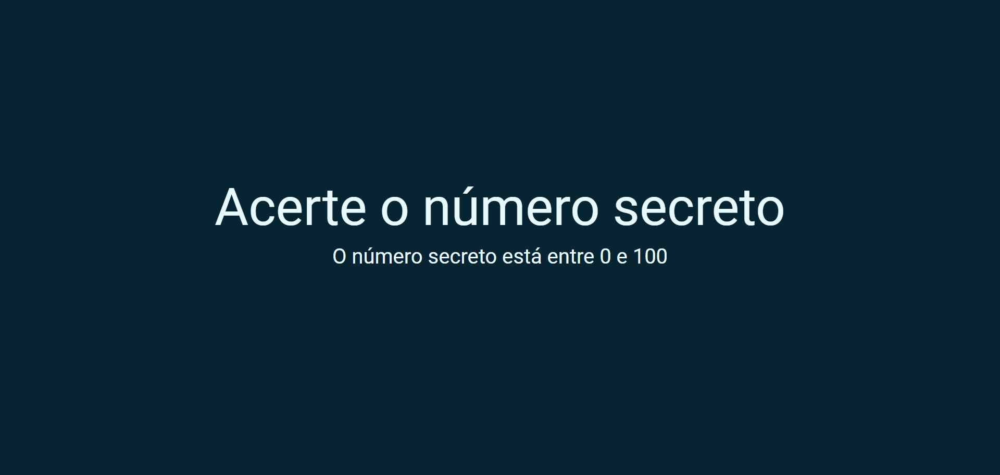

# Numero Secreto JS

Desenvolvido para aprendizado. 17/01/2023
Realizado durante aula de JavaScript onde foi feito validações e reconhecimento de voz. 

[🔗 Clique aqui para acessar] (https://michel-maia.github.io/Numero-Secreto-JS/)

## 💻 Tecnologias

- HTML
- CSS
- JavaScript 

## Referência

- [alura] [https://www.alura.com.br/]
- [MDN] [https://developer.mozilla.org/en-US/docs/Web/API/Web_Speech_API/Using_the_Web_Speech_API]

